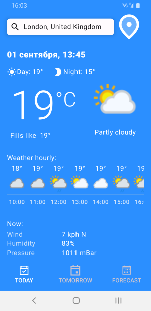
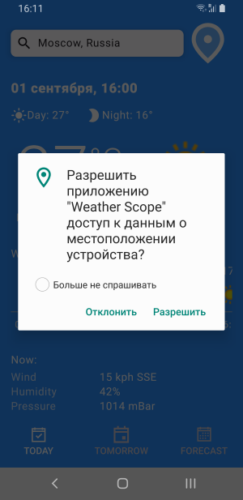
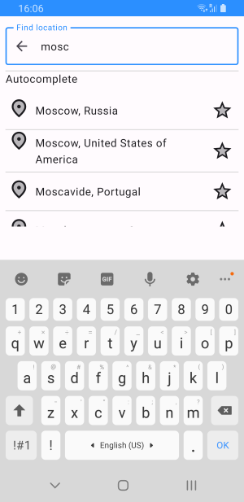
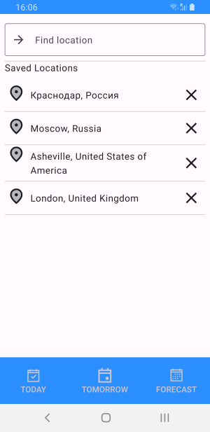
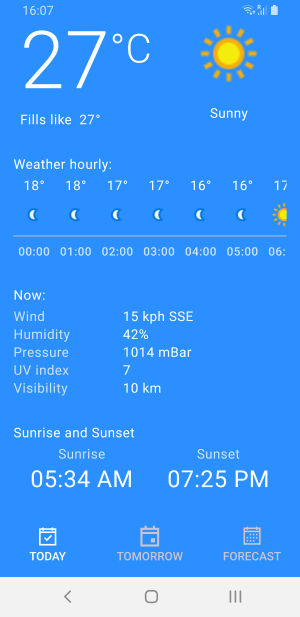
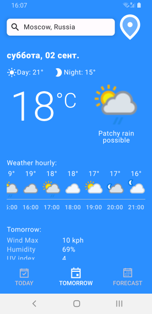
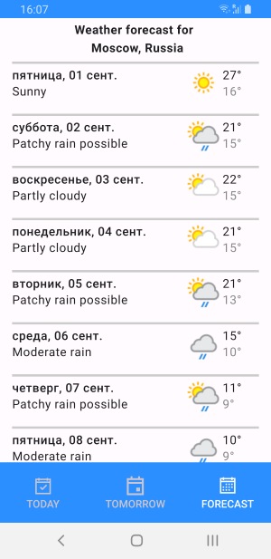
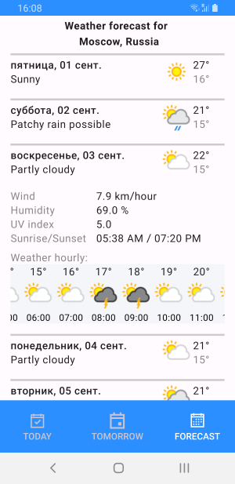
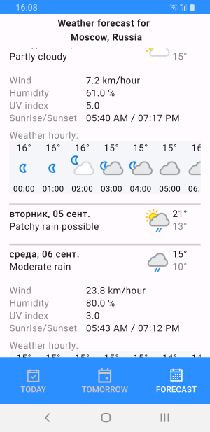

Видео демонстрация:

https://drive.google.com/file/d/18TNjzeotr0LzUnn_pldWwY9mZdINqxBb/view?usp=sharing

Скриншоты:

---------------

------------

------------

------------

------------

-----------

--------------

------------------

-------------------

Что еще планирую сделать:
1. Обновление погоды по свайпу. (сделано)
2. Менять цвет звезды на желтый, если локация уже в избранном.
3. Заменить дефолтные иконки.
4. Сделать экран настроек (единицы измерения, цвета, иконки)
5. Добавить размытый задний фон.
6. Разбить большие Compose на более компактные.
7. Уменьшить повторения кода. (В процессе)
8. Добавить определение геопозиции. (сделано)
9. Закончить экран "Tomorrow" (сделано)

